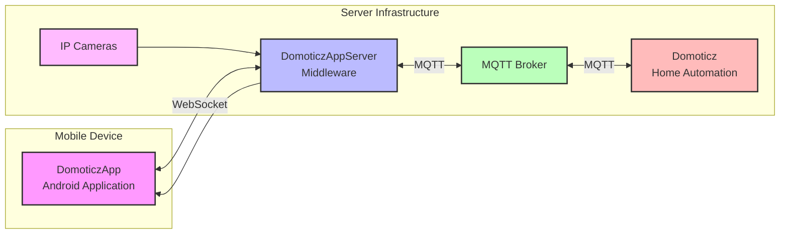
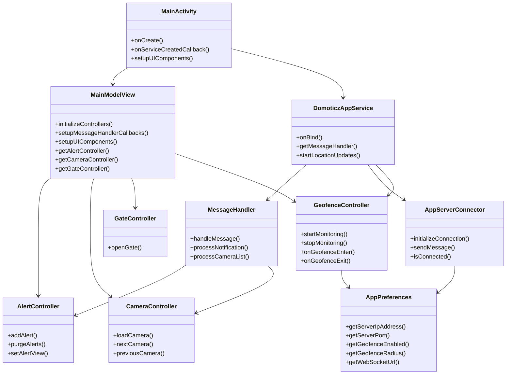
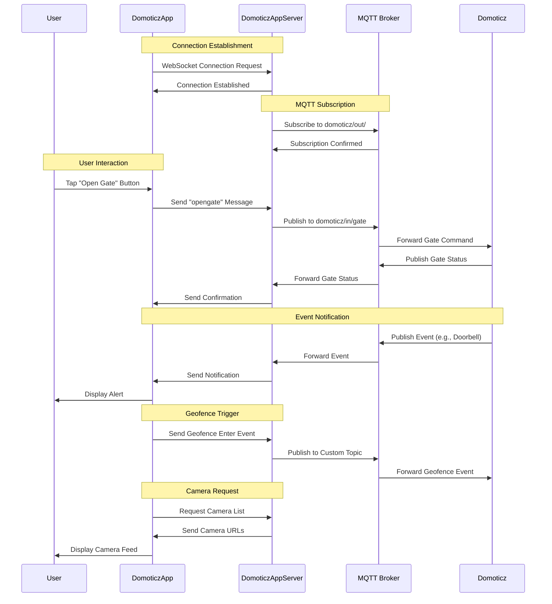
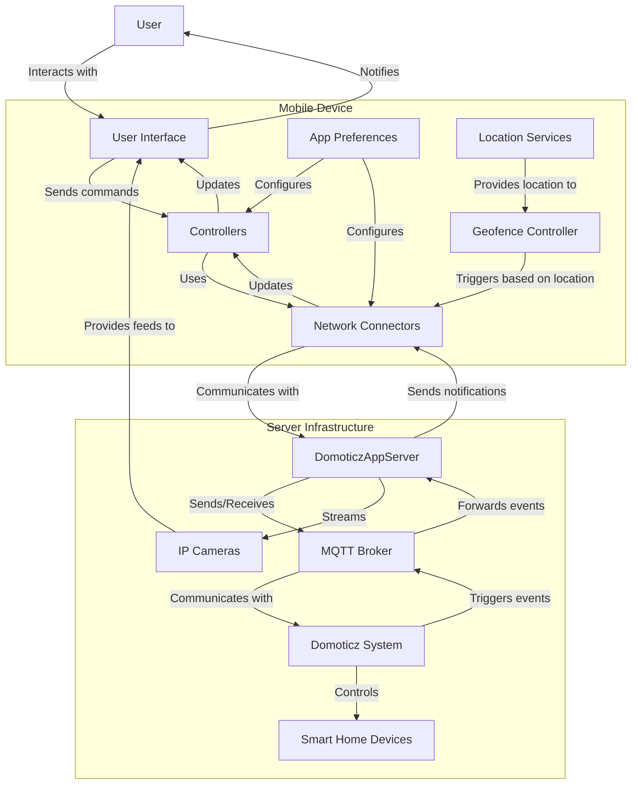
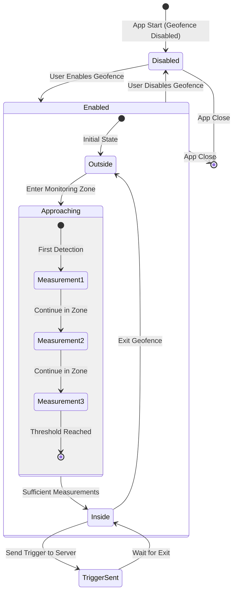
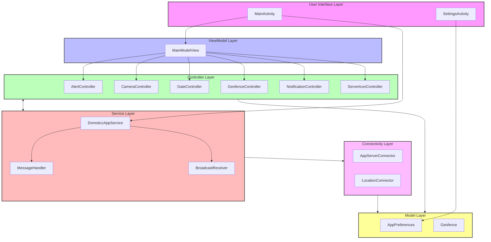

# DomoticzApp Architecture Diagrams

This document provides visual representations of the DomoticzApp architecture using Mermaid diagrams.

## System Architecture

The following diagram shows the overall architecture of the DomoticzApp ecosystem:



## App Component Structure

The following diagram shows the main components of the DomoticzApp:



## Communication Flow

The following sequence diagram shows the communication flow between the app, server, and Domoticz:



## Data Flow Diagram

The following diagram shows the data flow within the DomoticzApp ecosystem:



## State Diagram for Geofence

The following state diagram shows the states and transitions for the geofence functionality:



## Component Interaction Diagram

The following diagram shows how the different components of the app interact:



## Server Architecture

The following diagram shows the architecture of the DomoticzAppServer:

```mermaid
flowchart TB
    subgraph Main[Main Application]
        main.py
    end
    
    subgraph Connectivity[Connectivity Layer]
        domoticzAppAPI[domoticzAppAPI.py]
        mqttConnection[mqttConnection.py]
        cameraConnection[cameraConnection.py]
    end
    
    subgraph Controller[Controller Layer]
        alertHandler[alertHandler.py]
        appMessageHandler[appMessageHandler.py]
        cameraHandler[cameraHandler.py]
        gateStateHandler[gateStateHandler.py]
        mqttMessageHandler[mqttMessageHandler.py]
    end
    
    subgraph Model[Model Layer]
        alertQueue[alertQueue.py]
        messageFilter[messageFilter.py]
    end
    
    subgraph Utils[Utilities]
        logger[logger.py]
    end
    
    main.py --> Connectivity
    main.py --> Controller
    
    domoticzAppAPI --> appMessageHandler
    mqttConnection --> mqttMessageHandler
    cameraConnection --> cameraHandler
    
    appMessageHandler --> alertHandler
    appMessageHandler --> gateStateHandler
    appMessageHandler --> cameraHandler
    
    mqttMessageHandler --> alertHandler
    mqttMessageHandler --> gateStateHandler
    
    alertHandler --> alertQueue
    mqttMessageHandler --> messageFilter
    
    Controller --> Utils
    Connectivity --> Utils
    
    style Main fill:#f9f,stroke:#333,stroke-width:2px
    style Connectivity fill:#bbf,stroke:#333,stroke-width:2px
    style Controller fill:#bfb,stroke:#333,stroke-width:2px
    style Model fill:#fbb,stroke:#333,stroke-width:2px
    style Utils fill:#fbf,stroke:#333,stroke-width:2px
