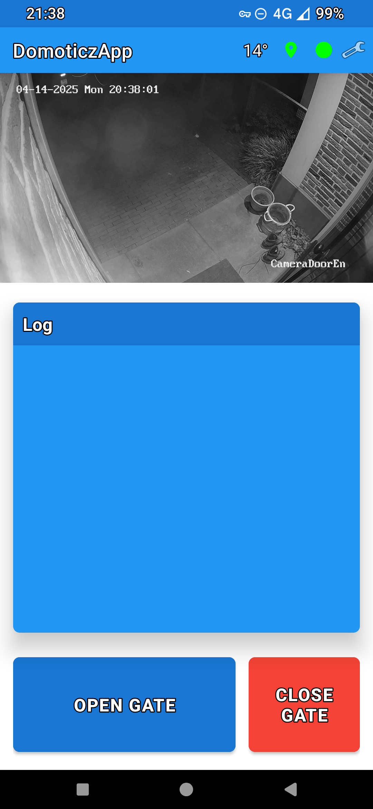
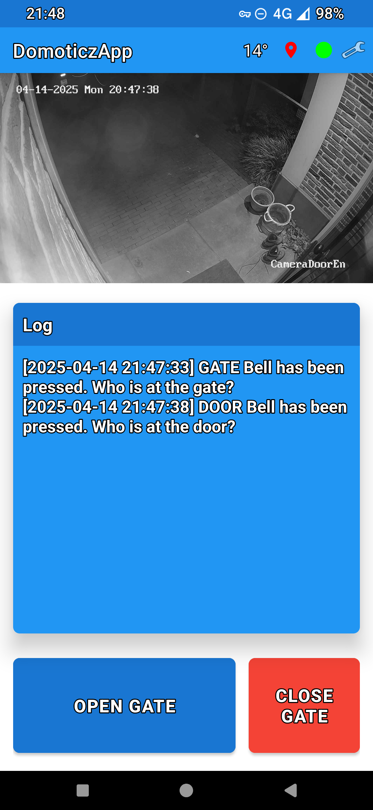
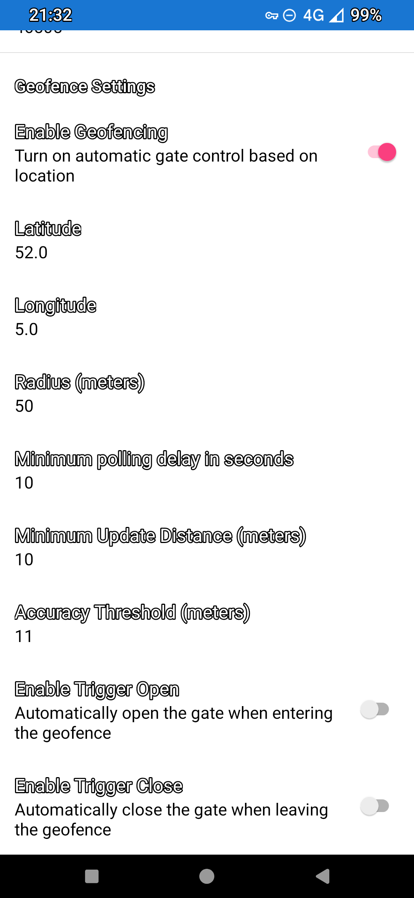
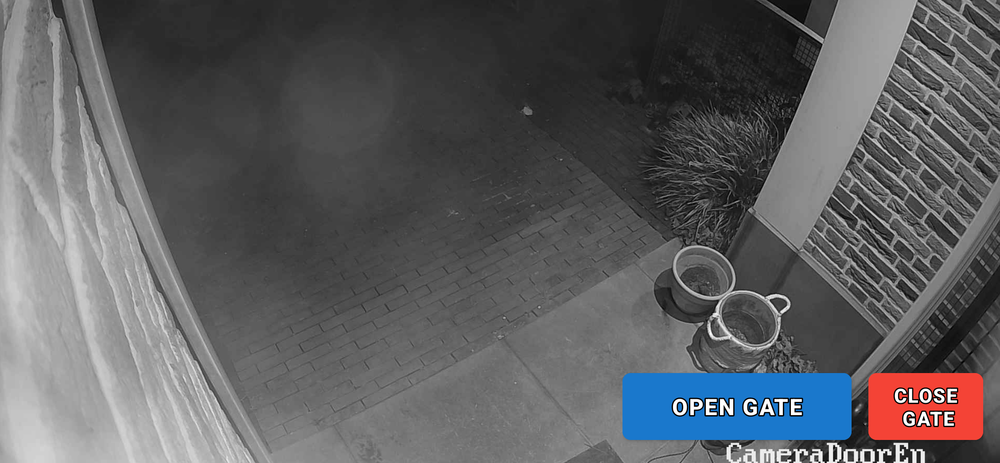

# DomoticzApp

DomoticzApp is a mobile Android application designed to interact with a Domoticz home automation system through a middleware server. The app provides real-time notifications, camera feeds, gate control, and geofence-based automation for an enhanced smart home experience. In fact the app is targeting my own use case but probably it is a starting point for others that would like to thave a specific app to interact with their home automation system.

<p align="center">
  
  
  
</p>
<p align="center">
  
</p>

## System Requirements

- Android 6.0 (API level 23) or higher
- Java Development Kit (JDK) 17
- Android Studio Arctic Fox or newer
- Domoticz server with MQTT support
- DomoticzAppServer middleware (see [Server Component](#server-component))

## Features

1. **Real-time Notifications**: Receive instant alerts from your Domoticz system when events are triggered (doorbell, gate bell, alarms, etc.)
2. **Camera Integration**: View camera feeds directly in the app with swipe navigation between multiple cameras
3. **Gate Control**: One-tap gate opening functionality
4. **Geofence Automation**: Proximity-based triggers that activate when you approach your home
5. **Alert Management**: Swipe-to-dismiss notification system with history
6. **Customizable Settings**: Configure geofence parameters, server connection details, and notification preferences

## Installation

### Prerequisites

1. Ensure you have Android Studio installed with SDK 34
2. Make sure the DomoticzAppServer is set up and running (see [Server Component](#server-component))
3. Configure your Domoticz system with appropriate devices and MQTT integration

### Building the App

1. Clone the repository:
   ```bash
   git clone https://github.com/yourusername/domoticzApp.git
   cd domoticzApp
   ```

2. Open the project in Android Studio:
   - Launch Android Studio
   - Select "Open an existing Android Studio project"
   - Navigate to the cloned repository and select it

3. Build the project:
   - Select Build > Make Project from the menu
   - Or use the Gradle task: `./gradlew assembleDebug`

4. Install on your device:
   - Connect your Android device via USB with debugging enabled
   - Select Run > Run 'app' from the menu
   - Or use the Gradle task: `./gradlew installDebug`

## Configuration

### App Settings

The app can be configured through the Settings screen, accessible from the main menu. Key settings include:

- **Server Connection**:
  - Server IP Address (default: 192.168.0.1)
  - Server Port (default: 8080)

- **Geofence Settings**:
  - Enable/Disable Geofence
  - Geofence Center (Latitude/Longitude)
  - Geofence Radius (default)
  - Minimum Polling Frequency (default: 60 seconds)
  - Minimum Update Distance 
  - Accuracy Threshold in meters
  
### Custom Device Configuration

The app supports up to 5 configurable devices and 8 cameras. Device names and notification messages can be customized by modifying the `app/build.gradle.kts` file:

```kotlin
buildConfigField("String", "DEVICE_1", "\"YourCustomDeviceName\"")
buildConfigField("String", "DEVICE_1_MESSAGE", "\"Your custom notification message\"")
buildConfigField("int", "MAX_CAMERAS", "8")
```

## Usage

### Initial Setup

1. Launch the app and navigate to Settings
2. Configure the server connection with your DomoticzAppServer IP and port
3. Set up the geofence location by entering coordinates or using the current location
4. Adjust other settings according to your preferences
5. Return to the main screen to start using the app

### Main Features

- **Viewing Cameras**: The main screen displays camera feeds. Swipe left or right to navigate between cameras.
- **Gate Control**: Tap the "Open Gate" button to trigger the gate opening mechanism.
- **Alerts**: Notifications appear as cards that can be swiped away to dismiss.
- **Status Icons**: The app displays icons indicating geofence status and server connection status.

## Server Component

The DomoticzApp requires the DomoticzAppServer middleware to function properly. This server:

- Acts as a bridge between the mobile app and Domoticz
- Handles WebSocket connections for real-time communication
- Translates app commands to MQTT messages for Domoticz
- Manages authentication and security

For detailed information on setting up the server component, refer to the [DomoticzAppServer README](../domoticzAppServer/README.md).

## Project Structure

```
domoticzApp/
├── app/                           # Main application module
│   ├── src/main/
│   │   ├── java/com/wiconic/domoticzapp/
│   │   │   ├── connectivity/      # Network and location services
│   │   │   ├── controller/        # UI and business logic controllers
│   │   │   ├── model/             # Data models and preferences
│   │   │   ├── service/           # Background services
│   │   │   └── ui/                # Activities and UI components
│   │   ├── res/                   # Resources (layouts, strings, etc.)
│   │   └── AndroidManifest.xml    # App manifest
│   └── build.gradle.kts           # App-level build configuration
└── build.gradle.kts               # Project-level build configuration
```

## Troubleshooting

### Common Issues

1. **Connection Problems**:
   - Verify the server IP and port in Settings
   - Check that the DomoticzAppServer is running
   - Ensure your device has network connectivity to the server

2. **Geofence Not Triggering**:
   - Verify location permissions are granted
   - Check that geofence is enabled in Settings
   - Ensure the geofence coordinates are correct
   - Try increasing the geofence radius

3. **Camera Feed Issues**:
   - Verify camera URLs in your server configuration
   - Check network connectivity to camera streams
   - Ensure the cameras are online and accessible

### Logs

The app logs important events and errors to the Android logcat. To view logs:

```bash
adb logcat -s MainActivity DomoticzAppService AppServerConnector
```

## Contributing

We welcome contributions to improve DomoticzApp! Here's how you can contribute:

1. Fork the repository
2. Create a feature branch: `git checkout -b feature/your-feature-name`
3. Commit your changes: `git commit -m 'Add some feature'`
4. Push to the branch: `git push origin feature/your-feature-name`
5. Submit a pull request

Please follow the project's coding style and include appropriate tests.

## License

This project is licensed under the MIT License - see the [LICENSE](LICENSE) file for details.

The MIT License is a permissive license that is short and to the point. It lets people do anything they want with your code as long as they provide attribution back to you and don't hold you liable.
